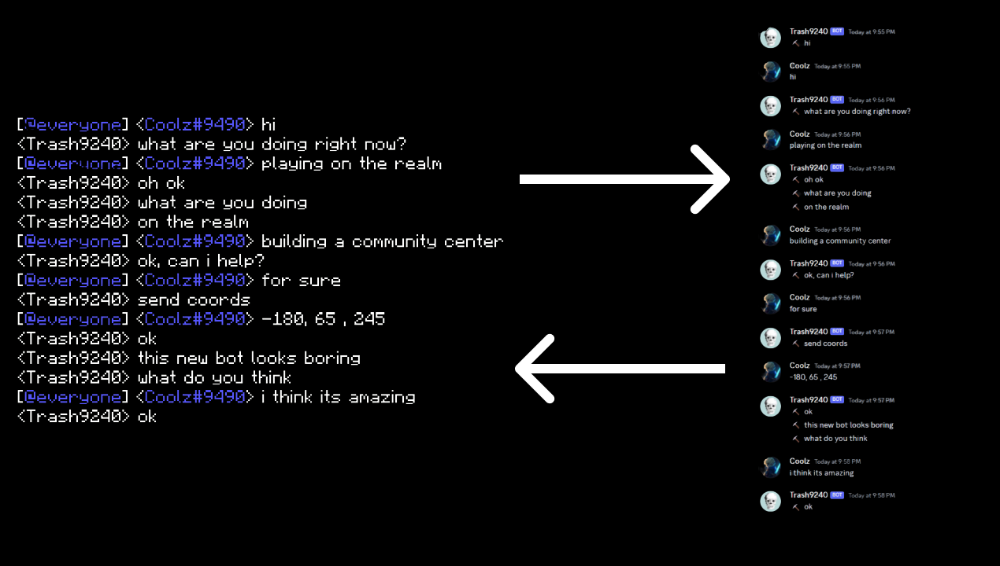

# AzaleaBridge-Bedrock
Connects Minecraft chat to Discord and Discord chat to Minecraft. Might make a Java version sometime, idk.

# ⭐ Features
* 🔗 Uses discord webhooks
* 📄 Relays chat messages from minecraft to discord, and discord to minecraft
* 💬 Send tellraws to minecraft easily
* 💻 Run commands in minecraft remotely from discord
* 👤 Gets user profile pictures using OpenXbl
* 🪟 GUI setup
* 🌎 Web dashboard
* 🆓 Completely free and open-source, no paid version
* 📢 Relay discord announcements to minecraft
* 🚫 Exclude prefixes for Azalea
* 💬 Azalea chat rank compatible
* 📎 Shows attachment indicators (a little number displaying attachments)
* 💬 Shows message replies
* 🔴 Recognizes pings

Anyways, the setup is pretty easy because of the GUI. If you need any setup help, [DM Me On Discord](https://discord.com/users/693208615451885568) and tell me that you need help with the bot and what exactly you need help with.
